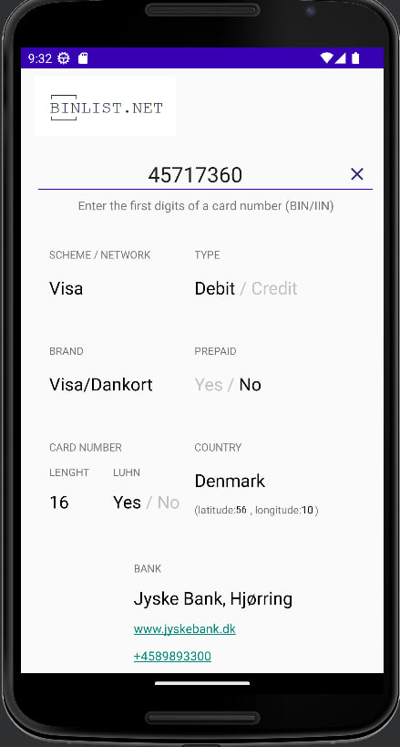

# Binlist
Android приложение для отображения информации о BIN банковской карты с помощью API сайта https://binlist.net/

### Текущая реализация
- [x] Ввод пользовательски данных BIN банковской карты
- [x] Отображение полученных через API данных карты. Использована библиотека Volley
- [x] Реализованы активные ссылки для url банка, телефона банка. Нажатие на ссылку вызывает соответствующее приложение смартфона, которое сможет это обработать (браузер, звонилка) посредством xml разметки

### В работе
- [ ] Отображение истории предыдущих запросов в строке писка BIN карты (работа с базой данных с помощью функционала Room и AutoCompleteTextView)

